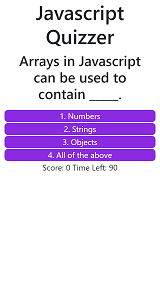
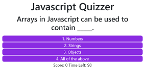
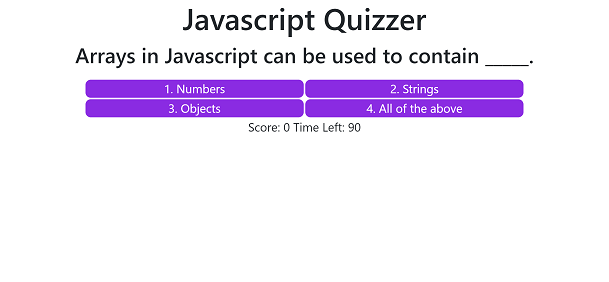

# Javascript quiz
## Table of Contents
* [What is it?](https://github.com/Andrew836-dev/quiz-game#what-is-it)
* [Screenshots](https://github.com/Andrew836-dev/quiz-game#screenshot)
* [How Does it Work?](https://github.com/Andrew836-dev/quiz-game#how-does-it-work)
* [Link to Deployed App](https://github.com/Andrew836-dev/quiz-game#link)
## What is it?
### A responsive quiz interface.
This is homework for week 4 of my coding bootcamp. The goal is to use javascript to make a responsive quiz app, using localstorage for a high-score list. I've moved the questionlist into a separate file for easier updating.
## Screenshots

## How does it work?
I chose to make a basic page of HTML elements and then some document.createElement instructions in the Javascript. Every time the user clicks an option the inner html of the question-list div is completely cleared and any required components are created or altered as needed and then appended.

Bootstrap is utilised for the font and initial margins, also for the row class and easy flex-box settings.

'li' objects have been given a :hover property in CSS so they will change colour to make it look more dynamic.
## Link
[live site](https://andrew836-dev.github.io/quiz-game/)
