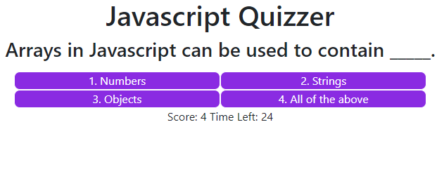
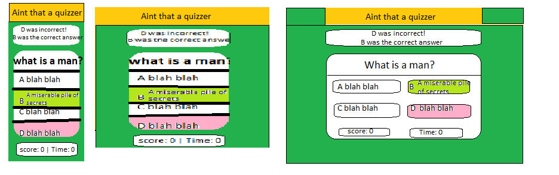

## quiz-game
A responsive quiz interface

This is homework for week 4 of my coding bootcamp. The goal is to use javascript to make a responsive quiz app.

[live site](https://andrew836-dev.github.io/quiz-game/)

Screenshot

Layout Plan
